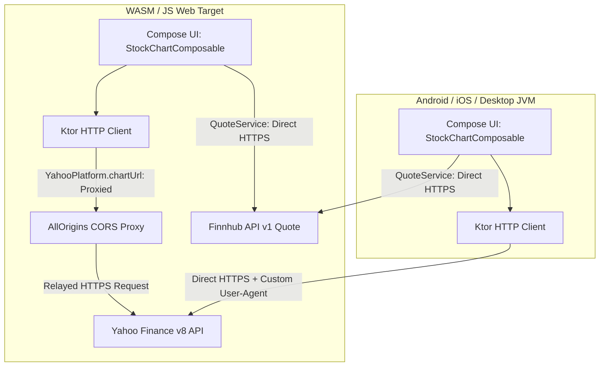

# Requirements

### Overview & Goals
The goal of this task is to compile and export a comprehensive, structured `work.md` document at the root of the project. This document serves as the complete record and reference for all the debugging, architectural changes, network fixes, and validation performed to make OnlyFunds run successfully on the Web/WASM platform.

### Scope
#### In Scope
- **WASM Top Stocks Lifecycle Issue**: Detailed root cause analysis of why polling did not start on web (`ComposeViewport` DOM attachment) and the applied fix.
- **WASM Stock Chart Network & CORS Issue**: Detailed analysis of why chart data failed on web (CORS restrictions on Yahoo Finance API, forbidden `User-Agent` headers in browsers, content-type mismatch with CORS proxies).
- **Expect/Actual Platform Architecture**: Architecture documentation for `YahooPlatform` spanning `commonMain`, `androidMain`, `iosMain`, `jvmMain`, and `webMain`.
- **Ktor Serialization & Body Handling**: Explanation of why direct JSON deserialization via `response.bodyAsText()` replaced `ContentNegotiation` plugin parsing for the proxied chart endpoint.
- **Composables Validation Report**: Findings from running all UI composables (`TopExpensiveStocksComposable`, `StockChartComposable`, SMA overlays, timeframe selectors, landscape/portrait orientation) on Web/WASM.
- **Finnhub Rate Limiting & Recommendations**: Analysis of HTTP 429 burst issues on web reloads and concrete mitigation strategies (batching, throttling, caching).
- **Automated Verification Harness**: Reference Node.js Chrome DevTools Protocol (CDP) scripts and Gradle commands used to build and verify the WASM bundle.

#### Out of Scope
- Modifying production backend servers or deploying dedicated proxy infrastructure during this planning phase.
- Modifying native platform behaviors beyond the expect/actual abstractions.

### User Stories
- **As a Developer**, I want a complete `work.md` document detailing all WASM-specific fixes and architectural decisions so that I can easily understand, reproduce, review, or extend the web support in the future.
- **As a Maintainer**, I want clear verification steps and CDP test scripts documented so that I can validate future Compose Multiplatform Web releases without manual trial and error.

### Functional Requirements
- `work.md` must be created in the project root directory (`/Users/michaliskolozoff/AndroidStudioProjects/OnlyFunds/work.md`).
- `work.md` must contain full explanations of both the TopStocks and StockChart fixes with before-and-after code diffs.
- `work.md` must include executable build commands, CDP test scripts, and known platform caveats (e.g. headless WebGL2 limitations, Finnhub rate limits).

# Technical Design

### Current Implementation & Root Causes

#### 1. Top Stocks Lifecycle Failure on WASM
- **Original Code**: `ComposeViewport { App() }` in `composeApp/src/webMain/kotlin/compose/demo/onlyfunds/main.kt`.
- **Root Cause**: In Compose Multiplatform for Web, calling `ComposeViewport` without specifying a container element defaults to looking for an existing `<canvas id="ComposeTarget">`. In `index.html`, only `<body>` existed without a canvas element, so Compose never mounted to the DOM. As a result, the `DisposableEffect` in `TopExpensiveStocksComposable` that invokes `viewModel.startPolling()` was never triggered.
- **Fix**: Updated to `ComposeViewport(document.body!!) { App() }`, ensuring the root canvas is automatically generated and attached to `document.body`.

#### 2. Stock Chart Network Failure on Web/WASM
- **CORS Blockage**: Yahoo Finance API (`https://query1.finance.yahoo.com/v8/finance/chart/...`) does not return `Access-Control-Allow-Origin` headers. In browser environments (WASM/JS), `fetch()` requests are rejected by the browser security sandbox (`TypeError: Failed to fetch`).
- **Forbidden User-Agent Header**: `YahooApiClient` configured a `defaultRequest` with `HttpHeaders.UserAgent`. Browsers prohibit client scripts from setting `User-Agent` (part of the Fetch API forbidden header list), causing network requests to throw exceptions.
- **Content-Type Mismatch with CORS Proxy**: When routing requests via the public CORS proxy `https://api.allorigins.win/raw?url=...`, the proxy returns `Content-Type: text/plain; charset=UTF-8`. Ktor's `ContentNegotiation` plugin expects `application/json` and fails to deserialize the body.
- **Finnhub Candle API Limitation**: Finnhub's `/stock/candle` endpoint returns HTTP 403 Forbidden on free tier accounts (`{"error":"You don't have access to this resource."}`), necessitating the Yahoo Finance chart endpoint for historical candlestick data.

### Proposed Architecture & Key Decisions

#### Key Decision 1: Expect/Actual `YahooPlatform` Abstraction
To keep native platforms (Android, iOS, JVM Desktop) making fast, direct HTTPS calls with custom `User-Agent` headers while allowing Web targets (`wasmJs`, `js`) to relay through a CORS proxy without custom headers:
- `network/src/commonMain/kotlin/io/onlyfunds/network/YahooPlatform.kt`:
  ```kotlin
  internal expect object YahooPlatform {
      val userAgent: String?
      fun chartUrl(url: String): String
  }
  ```
- `network/src/webMain/kotlin/io/onlyfunds/network/YahooPlatform.web.kt`:
  ```kotlin
  internal actual object YahooPlatform {
      actual val userAgent: String? = null
      actual fun chartUrl(url: String): String =
          YahooConfig.CORS_PROXY_PREFIX + url.encodeURLParameter()
  }
  ```
- `network/src/{androidMain,iosMain,jvmMain}/.../YahooPlatform.*.kt`:
  ```kotlin
  internal actual object YahooPlatform {
      actual val userAgent: String? = YahooConfig.USER_AGENT
      actual fun chartUrl(url: String): String = url
  }
  ```

#### Key Decision 2: Manual JSON Deserialization in `YahooChartService`
In `YahooChartService`, decode using `Json { ignoreUnknownKeys = true }.decodeFromString<YahooChartResponse>(response.bodyAsText())`. This handles both native `application/json` responses and proxy `text/plain` responses uniformly without relying on content negotiation header matching.

### Architecture Diagram



### File Structure & Changes Inventory
- `composeApp/src/webMain/kotlin/compose/demo/onlyfunds/main.kt` — updated `ComposeViewport(document.body!!)`
- `network/src/commonMain/kotlin/io/onlyfunds/network/YahooConfig.kt` — added `CORS_PROXY_PREFIX`
- `network/src/commonMain/kotlin/io/onlyfunds/network/YahooPlatform.kt` — expect object definition
- `network/src/webMain/kotlin/io/onlyfunds/network/YahooPlatform.web.kt` — web actual implementation
- `network/src/androidMain/kotlin/io/onlyfunds/network/YahooPlatform.android.kt` — Android actual implementation
- `network/src/iosMain/kotlin/io/onlyfunds/network/YahooPlatform.ios.kt` — iOS actual implementation
- `network/src/jvmMain/kotlin/io/onlyfunds/network/YahooPlatform.jvm.kt` — JVM actual implementation
- `network/src/commonMain/kotlin/io/onlyfunds/network/YahooApiClient.kt` — conditional User-Agent header
- `network/src/commonMain/kotlin/io/onlyfunds/network/YahooChartService.kt` — proxied URL request & manual JSON decoding
- `composeApp/build.gradle.kts` & `network/build.gradle.kts` — test coroutines dependencies
- `work.md` (to be added) — complete technical report and guide

# Testing

### Validation Approach
Verification of WASM targets involves three tiers:
1. **Compilation & Packaging**: Building production web distributions via `./gradlew :composeApp:wasmJsBrowserDistribution`.
2. **End-to-End Browser Driving (CDP)**: Serving the distribution locally (`python3 -m http.server 8123`) and driving real Google Chrome via Chrome DevTools Protocol WebSocket.
3. **Interactive & Visual Regression Checks**: Triggering mouse clicks on specific list items, observing network request logs, and capturing screenshots of rendered canvases.

### Key Scenarios Verified

#### 1. Top Stocks Screen Polling & Rendering
- **Flow**: App loads -> `ComposeViewport(document.body!!)` initializes canvas -> `DisposableEffect` calls `viewModel.startPolling()` -> 16 quotes fetched from Finnhub API -> Top 10 stocks displayed with prices and percent changes.
- **Expected Outcome**: All 16 HTTP requests return status 200; stock ticker rows render with ticker symbol, company name, current price, and color-coded delta.

#### 2. Navigation & Stock Chart Rendering
- **Flow**: User clicks a stock row (e.g. coordinate `(600, 152)` for NVR) -> Compose navigates to `StockChartComposable` -> `StockChartViewModel.loadData()` requests 1-month daily candles -> Proxied Yahoo Finance request fires -> Candlestick chart and SMA indicator render.
- **Expected Outcome**: Network request to `https://api.allorigins.win/raw?url=...` returns HTTP 200 with 24+ candles; candlestick bars (green/red), volume bars, price axis, and timeframe buttons render correctly on canvas.

#### 3. Composable Interactions on Web
- Timeframe selection (1D, 5D, 1M, 6M, 1Y, 5Y).
- SMA overlay toggle (SMA 20, SMA 50).
- Backtest summary calculation and display.
- Orientation handling fallback on web (`ScreenOrientation.web.kt`).

### Known Technical Risks & Mitigations
- **Finnhub Rate Limiting (HTTP 429)**: The Finnhub free tier is limited to 30 requests/minute. Polling 16 quotes every 15 seconds produces ~64 requests/minute, causing 429 errors on repeated page reloads.
  - *Mitigation*: In production, batch requests or cache quotes in a shared state repository with a minimum refresh interval.
- **Public CORS Proxy Dependency**: `allorigins.win` is suitable for development and demo purposes but should not be relied upon for mission-critical production SLAs.
  - *Mitigation*: For production deployments, deploy a lightweight Cloudflare Worker or backend reverse proxy route (e.g. `/api/chart/{symbol}`).
- **Headless Chrome WebGL2 Limitation**: Headless Chrome without software rasterizer (`--use-gl=angle` or `--use-gl=swiftshader`) fails to create a WebGL2 context (`webgl2: NULL`), producing an empty canvas.
  - *Mitigation*: Use headful Chrome or explicitly configure software GL when running headless automated UI tests.

# Delivery Steps

### ✓ Step 1: Document WASM Root Causes and Architectural Solutions in work.md
`work.md` is created in the project root containing comprehensive technical documentation of the WASM TopStocks and Stock Chart issues and their solutions.

- Document the root cause and fix for the Top Stocks screen: Compose DOM binding via `ComposeViewport(document.body!!)` in `composeApp/src/webMain/kotlin/compose/demo/onlyfunds/main.kt`.
- Document the root cause and fix for the Stock Chart screen: browser CORS blocking, restricted `User-Agent` headers, and `text/plain` content-type deserialization.
- Document the `YahooPlatform` expect/actual architecture across `commonMain`, `androidMain`, `iosMain`, `jvmMain`, and `webMain`.
- Include complete file diffs and code snippets for `YahooPlatform.kt`, `YahooApiClient.kt`, `YahooChartService.kt`, and `YahooConfig.kt`.

### ✓ Step 2: Document Verification Procedures, Composables Validation, and Future Recommendations
`work.md` is updated with web composables validation results, Chrome DevTools Protocol automation scripts, and future production recommendations.

- Document the verification results for `TopExpensiveStocksComposable` and `StockChartComposable` running on Web/WASM.
- Include the Chrome DevTools Protocol (CDP) evaluation and screenshot automation scripts for headful Chrome verification.
- Document the Finnhub API rate limiting analysis (30 req/min free tier limit vs 16-symbol polling burst) and mitigation proposals (throttling, caching, batching).
- Document long-term architecture recommendations for proxying third-party financial APIs (self-hosted Cloudflare Worker / backend proxy vs public CORS proxies).