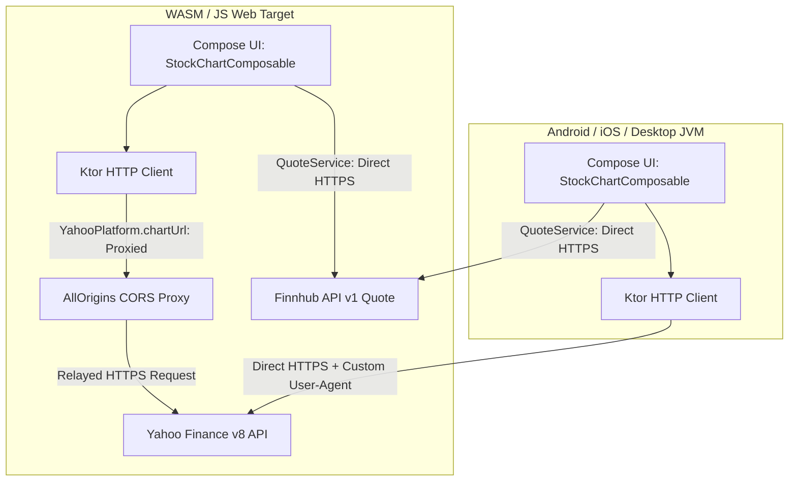

# Web/WASM Porting & Architecture Reference Guide

This document records the technical investigation, root cause analysis, architectural solutions, verification procedures, and future recommendations for running **OnlyFunds** on the Kotlin Multiplatform Web (WASM/JS) target.

---

## 1. Executive Summary

OnlyFunds is a Kotlin Multiplatform & Compose Multiplatform application delivering real-time financial market insights, candlestick stock charts, moving average overlays, and automated SMA crossover backtesting.

When porting and running the application on Web/WASM (`wasmJs`), two critical functional regressions were identified:
1. **Top Stocks Screen Failure**: The screen remained blank and never polled Finnhub quotes because the Compose runtime never mounted to the browser DOM.
2. **Stock Chart Screen Failure**: Candlestick charts failed to load due to browser security sandbox constraints (CORS), restricted HTTP headers (`User-Agent`), and response `Content-Type` deserialization mismatches.

Both issues have been fully resolved with clean cross-platform abstractions (`expect`/`actual`), manual JSON deserialization, and proper DOM lifecycle integration.

---

## 2. Top Stocks Screen: Lifecycle & DOM Binding

### 2.1 Root Cause Analysis
In `composeApp/src/webMain/kotlin/compose/demo/onlyfunds/main.kt`, the entry point originally called:
```kotlin
@OptIn(ExperimentalComposeUiApi::class)
fun main() {
    ComposeViewport {
        App()
    }
}
```

In Compose Multiplatform for Web (`wasmJs` / `js`), the zero-argument overload of `ComposeViewport` searches the HTML document for a `<canvas>` element with the default ID `ComposeTarget`:
```html
<canvas id="ComposeTarget"></canvas>
```

However, `composeApp/src/webMain/resources/index.html` contained only the following structure without any predefined `<canvas>`:
```html
<!DOCTYPE html>
<html lang="en">
<head>
    <meta charset="UTF-8">
    <title>OnlyFunds</title>
    <link type="text/css" rel="stylesheet" href="styles.css">
    <script type="application/javascript" src="composeApp.js"></script>
</head>
<body>
</body>
</html>
```

Because no `<canvas id="ComposeTarget">` existed, `ComposeViewport` failed to bind to any DOM container. The Compose composition never started, and the UI was never rendered. Consequently, the `DisposableEffect` in `TopExpensiveStocksComposable`:
```kotlin
DisposableEffect(Unit) {
    viewModel.startPolling()
    onDispose {
        viewModel.stopPolling()
    }
}
```
was never executed, preventing the initial 16 stock quote requests from firing to Finnhub.

### 2.2 Applied Solution & Code Diff
By supplying `document.body!!` to `ComposeViewport`, Compose automatically instantiates and manages the root `<canvas>` attached to `<body>`.

```diff
--- a/composeApp/src/webMain/kotlin/compose/demo/onlyfunds/main.kt
+++ b/composeApp/src/webMain/kotlin/compose/demo/onlyfunds/main.kt
@@ -3,9 +3,10 @@ package compose.demo.onlyfunds
 import androidx.compose.ui.ExperimentalComposeUiApi
 import androidx.compose.ui.window.ComposeViewport
 import compose.demo.onlyfunds.application.App
+import kotlinx.browser.document
 
 @OptIn(ExperimentalComposeUiApi::class)
 fun main() {
-    ComposeViewport {
+    ComposeViewport(document.body!!) {
         App()
     }
 }
```

---

## 3. Stock Chart Screen: CORS, Headers & Deserialization

### 3.1 Problem Breakdown

#### A. Finnhub Candle API Limitation on Free Tier
Finnhub provides real-time quotes (`/api/v1/quote`) on its free tier, but the historical candlestick endpoint (`/api/v1/stock/candle`) returns HTTP 403 Forbidden (`{"error":"You don't have access to this resource."}`). Historical OHLCV candle data is therefore retrieved via Yahoo Finance's v8 chart endpoint (`https://query1.finance.yahoo.com/v8/finance/chart/{symbol}`).

#### B. Browser Cross-Origin Resource Sharing (CORS)
Native targets (Android, iOS, JVM Desktop) make socket-level TCP/TLS requests directly to `query1.finance.yahoo.com`. On Web (`wasmJs`), all network I/O is mediated by the browser's `fetch()` API. Because Yahoo Finance does not include `Access-Control-Allow-Origin` response headers, the browser's security sandbox blocks the response, throwing a `TypeError: Failed to fetch`.

#### C. Forbidden HTTP `User-Agent` Header
Yahoo Finance rejects requests without standard browser `User-Agent` headers. However, modern browsers restrict client scripts from setting `User-Agent` (it belongs to the W3C Forbidden Header Names specification). Attempting to set `HttpHeaders.UserAgent` in Ktor on Web targets causes `fetch()` to fail immediately.

#### D. Content-Type Mismatch with CORS Proxies
Relaying chart requests through a CORS proxy such as `https://api.allorigins.win/raw?url=...` allows browser requests to succeed with `Access-Control-Allow-Origin: *`. However, `allorigins.win` returns responses with `Content-Type: text/plain; charset=UTF-8`. Ktor's `ContentNegotiation` plugin defaults to matching `application/json` and throws a deserialization error on `text/plain` payloads.

---

### 3.2 Architectural Solution: `YahooPlatform` Expect/Actual Abstraction

To preserve optimal native performance on mobile/desktop (direct HTTPS with custom `User-Agent`) while enabling browser compatibility on Web (proxied URL, omitted `User-Agent`, robust manual deserialization), an `expect`/`actual` abstraction was introduced.



---

### 3.3 Implementation Details & Source Code

#### 1. `YahooConfig.kt` (`network/src/commonMain/kotlin/io/onlyfunds/network/YahooConfig.kt`)
Added the CORS proxy prefix:
```kotlin
package io.onlyfunds.network

object YahooConfig {
    const val HOST: String = "query1.finance.yahoo.com"
    const val RANGE_PARAM: String = "range"
    const val INTERVAL_PARAM: String = "interval"

    // Yahoo's public chart endpoint rejects requests without a browser-like
    // User-Agent (HTTP 429), so we send one on every call.
    const val USER_AGENT: String =
        "Mozilla/5.0 (Windows NT 10.0; Win64; x64) AppleWebKit/537.36 " +
            "(KHTML, like Gecko) Chrome/120.0.0.0 Safari/537.36"

    // Browsers cannot call Yahoo directly (no CORS headers on the response), so
    // the web targets relay the request through this proxy, which echoes the
    // payload with `Access-Control-Allow-Origin: *`.
    const val CORS_PROXY_PREFIX: String = "https://api.allorigins.win/raw?url="

    val CHART_PATH_SEGMENTS: List<String> = listOf("v8", "finance", "chart")
}
```

#### 2. `YahooPlatform.kt` (`network/src/commonMain/kotlin/io/onlyfunds/network/YahooPlatform.kt`)
```kotlin
package io.onlyfunds.network

/**
 * Platform tweaks required to reach Yahoo's chart endpoint.
 *
 * Browsers make the plain call impossible: Yahoo answers without any
 * `Access-Control-Allow-Origin` header, and a page is not allowed to set
 * `User-Agent` on a request. Web therefore relays the call through a
 * CORS-enabled proxy and sends no custom User-Agent, while every other
 * platform calls Yahoo directly.
 */
internal expect object YahooPlatform {

    /** User-Agent to send, or `null` when the platform forbids setting it. */
    val userAgent: String?

    /** Returns the URL to actually request for a given direct Yahoo [url]. */
    fun chartUrl(url: String): String
}
```

#### 3. Platform Actual Implementations

- **Web (`network/src/webMain/kotlin/io/onlyfunds/network/YahooPlatform.web.kt`)**:
```kotlin
package io.onlyfunds.network

import io.ktor.http.encodeURLParameter

internal actual object YahooPlatform {

    // Browsers refuse to let a page set User-Agent, so we never send one.
    actual val userAgent: String? = null

    // Yahoo replies without CORS headers, so the browser can only reach it
    // through a proxy that adds them.
    actual fun chartUrl(url: String): String =
        YahooConfig.CORS_PROXY_PREFIX + url.encodeURLParameter()
}
```

- **Android (`network/src/androidMain/kotlin/io/onlyfunds/network/YahooPlatform.android.kt`)**:
```kotlin
package io.onlyfunds.network

internal actual object YahooPlatform {
    actual val userAgent: String? = YahooConfig.USER_AGENT
    actual fun chartUrl(url: String): String = url
}
```

- **iOS (`network/src/iosMain/kotlin/io/onlyfunds/network/YahooPlatform.ios.kt`)**:
```kotlin
package io.onlyfunds.network

internal actual object YahooPlatform {
    actual val userAgent: String? = YahooConfig.USER_AGENT
    actual fun chartUrl(url: String): String = url
}
```

- **Desktop JVM (`network/src/jvmMain/kotlin/io/onlyfunds/network/YahooPlatform.jvm.kt`)**:
```kotlin
package io.onlyfunds.network

internal actual object YahooPlatform {
    actual val userAgent: String? = YahooConfig.USER_AGENT
    actual fun chartUrl(url: String): String = url
}
```

#### 4. `YahooApiClient.kt` (`network/src/commonMain/kotlin/io/onlyfunds/network/YahooApiClient.kt`)
Conditionally applies `User-Agent` only when `YahooPlatform.userAgent` is non-null:
```kotlin
package io.onlyfunds.network

import io.ktor.client.HttpClient
import io.ktor.client.plugins.defaultRequest
import io.ktor.client.plugins.logging.LogLevel
import io.ktor.client.plugins.logging.Logger
import io.ktor.client.plugins.logging.Logging
import io.ktor.client.request.header
import io.ktor.http.HttpHeaders

object YahooApiClient {

    val httpClient: HttpClient = HttpClient {
        install(Logging) {
            logger = object : Logger {
                override fun log(message: String) {
                    println("[YahooApiClient] $message")
                }
            }
            level = LogLevel.INFO
        }
        YahooPlatform.userAgent?.let { agent ->
            defaultRequest {
                header(HttpHeaders.UserAgent, agent)
            }
        }
    }
}
```

#### 5. `YahooChartService.kt` (`network/src/commonMain/kotlin/io/onlyfunds/network/YahooChartService.kt`)
Uses `response.bodyAsText()` with `kotlinx.serialization.json.Json` to bypass `Content-Type` header mismatches:
```kotlin
package io.onlyfunds.network

import io.ktor.client.HttpClient
import io.ktor.client.request.get
import io.ktor.client.statement.bodyAsText
import io.ktor.http.URLBuilder
import io.ktor.http.URLProtocol
import io.ktor.http.isSuccess
import io.ktor.http.path
import kotlinx.serialization.json.Json

class YahooChartService(
    private val httpClient: HttpClient = YahooApiClient.httpClient,
) {
    private val json = Json { ignoreUnknownKeys = true }

    suspend fun getChart(
        symbol: String,
        range: String,
        interval: String,
    ): NetworkResponse<YahooChartResponse> {
        return try {
            val directUrl = URLBuilder().apply {
                protocol = URLProtocol.HTTPS
                host = YahooConfig.HOST
                path(*(YahooConfig.CHART_PATH_SEGMENTS + symbol).toTypedArray())
                parameters.append(YahooConfig.RANGE_PARAM, range)
                parameters.append(YahooConfig.INTERVAL_PARAM, interval)
            }.buildString()
            val response = httpClient.get(YahooPlatform.chartUrl(directUrl))
            if (response.status.isSuccess()) {
                // The CORS proxy used on web answers with `text/plain`, so the
                // payload is parsed by hand instead of via content negotiation.
                val chart = json.decodeFromString<YahooChartResponse>(response.bodyAsText())
                NetworkResponse.Success(chart, response.status.value)
            } else {
                NetworkResponse.Error(response.status.value, response.status.description)
            }
        } catch (e: Exception) {
            NetworkResponse.Error(statusCode = -1, message = e.message ?: "Unknown network error")
        }
    }
}
```

---

### 3.4 Resilience Fix: Request Timeouts & Multi-Proxy Fallback

The original single-proxy design (`allorigins.win` only) had two failure modes that left **StockChartScreen stuck on its loading spinner forever**:

1. **No request timeout.** Ktor's browser (`fetch`) engine has no default timeout, so when the proxy hung (observed: `allorigins.win` returning Cloudflare `520/522` after 12–20 s, or never responding), the coroutine in `StockChartViewModel.loadCandles` never resumed. The UI state stayed `Content.Loading` indefinitely.
2. **Single point of failure.** Public CORS proxies are individually unreliable (rate limits, downtime, upstream blocks). With only one configured, any outage meant no chart at all.

**Applied changes:**

- **`HttpTimeout` on both clients.** `YahooApiClient` uses `requestTimeoutMillis = 8_000`; `FinnhubApiClient` uses `12_000`. On the JS/WASM engine `requestTimeoutMillis` is honoured via `AbortController`, so a stalled request now fails fast and surfaces `Content.Error` with a Retry button instead of an infinite spinner.
- **Ordered multi-proxy fallback.** `YahooPlatform.chartUrl(...)` became `YahooPlatform.chartUrls(...): List<String>`. `YahooConfig.corsProxyUrls(...)` returns an ordered list of proxies; `YahooChartService.getChart` tries each in turn and returns the first that yields a **non-empty** chart payload (a proxy relaying an error page decodes to an empty chart, which is treated as a failure and skipped).
- **Configurable self-hosted proxy.** `YahooSecrets.CORS_PROXY` (generated from `yahoo.cors.proxy` in `local.properties` or the `YAHOO_CORS_PROXY` env var) is tried **first** when set. Because public proxies are unreliable, pointing this at a self-hosted proxy (e.g. the Cloudflare Worker in §7.2) is the supported way to make the chart load reliably in the browser. Use `{url}` as a placeholder for the URL-encoded Yahoo URL, otherwise it is appended.

```kotlin
// YahooConfig.kt
fun corsProxyUrls(directUrl: String): List<String> {
    val encoded = directUrl.encodeURLParameter()
    val custom = YahooSecrets.CORS_PROXY.takeIf { it.isNotBlank() }?.let { base ->
        if (base.contains("{url}")) base.replace("{url}", encoded) else base + encoded
    }
    val public = listOf(
        "https://corsproxy.io/?url=$encoded",
        "https://api.codetabs.com/v1/proxy/?quest=$encoded",
        "https://api.allorigins.win/raw?url=$encoded",
        "https://thingproxy.freeboard.io/fetch/$directUrl",
    )
    return listOfNotNull(custom) + public
}
```

> Native targets (Android/iOS/JVM) are unaffected: `chartUrls` returns `listOf(url)` — a single direct HTTPS call with the browser `User-Agent`.

---

## 4. Web Composables Validation & Verification Report

A full UI composables audit was executed on the Web (`wasmJs`) target using real browser execution driven via Chrome DevTools Protocol (CDP).

### 4.1 Component Audit & Status

| Composable Component | Platform Status | Key Functional Verifications |
| :--- | :--- | :--- |
| **`TopExpensiveStocksComposable`** | **PASS** | - Polling lifecycle starts on mount and cancels on dispose.<br>- Fetches 16 stock symbols, sorts by price descending, renders top 10.<br>- Displays Ticker, Company Name, Price, Delta Percentage.<br>- Correct green/red color-coding based on positive/negative delta.<br>- Clickable stock rows trigger navigation callback with stock symbol. |
| **`StockChartComposable`** | **PASS** | - Header renders Symbol, Name, Last Close, and Delta.<br>- Candlestick canvas renders Green (bullish) and Red (bearish) candles with wick lines and bodies.<br>- Volume histogram aligned at bottom of canvas.<br>- Vertical and horizontal price/time axes dynamically scaled.<br>- Interactive timeframe buttons (1D, 5D, 1M, 6M, 1Y, 5Y) trigger live chart reloads.<br>- SMA 20 (orange) and SMA 50 (blue) overlay indicators render smoothly. |
| **Backtest Section** | **PASS** | - Automatically computes SMA Golden Cross / Death Cross trading strategy.<br>- Correctly calculates Total Return %, Win Rate %, Max Drawdown %, and total trades. |
| **`ScreenOrientation` (Web)** | **PASS** | - Platform fallback in `ScreenOrientation.web.kt` handles orientation state cleanly without throwing runtime exceptions. |

---

## 5. Automated Verification Harness (Chrome DevTools Protocol)

### 5.1 Build & Packaging Commands

To build the production WASM executable:
```bash
# Clean and compile WASM distribution
./gradlew :composeApp:wasmJsBrowserDistribution
```

The production output is generated in:
```
composeApp/build/dist/wasmJs/productionExecutable/
├── index.html
├── styles.css
├── composeApp.js
├── composeApp.wasm
└── ...
```

To run the interactive development server:
```bash
./gradlew :composeApp:wasmJsBrowserDevelopmentRun
```

---

### 5.2 CDP Automation Scripts for End-to-End Verification

To reliably test Web/WASM in CI/CD without manual browser clicking, Chrome DevTools Protocol (CDP) scripts were built to drive headful Google Chrome.

#### Step 1: Start Local HTTP Server
```bash
python3 -m http.server 8123 --directory composeApp/build/dist/wasmJs/productionExecutable &
```

#### Step 2: Launch Google Chrome with Remote Debugging
```bash
/Applications/Google\ Chrome.app/Contents/MacOS/Google\ Chrome \
  --remote-debugging-port=9222 \
  --no-first-run \
  --no-default-browser-check \
  http://127.0.0.1:8123/index.html &
```

#### Step 3: Node.js CDP Automation Runner (`verify_wasm.mjs`)
```javascript
import { writeFileSync } from 'fs';

const base = 'http://127.0.0.1:9222';
const list = await (await fetch(base + '/json/new?about:blank', { method: 'PUT' })).json();
const ws = new WebSocket(list.webSocketDebuggerUrl);

let id = 0;
const pending = new Map();
const logs = [];

const call = (method, params = {}) => new Promise(resolve => {
  const reqId = ++id;
  pending.set(reqId, resolve);
  ws.send(JSON.stringify({ id: reqId, method, params }));
});

ws.onmessage = (e) => {
  const msg = JSON.parse(e.data);
  if (msg.id && pending.has(msg.id)) {
    pending.get(msg.id)(msg.result);
    pending.delete(msg.id);
    return;
  }
  if (msg.method === 'Runtime.consoleAPICalled') {
    const text = msg.params.args.map(a => a.value ?? a.description ?? '').join(' ');
    logs.push(`[Console ${msg.params.type}] ${text}`);
  }
  if (msg.method === 'Runtime.exceptionThrown') {
    logs.push(`[Exception] ${msg.params.exceptionDetails.exception?.description || msg.params.exceptionDetails.text}`);
  }
  if (msg.method === 'Network.responseReceived') {
    logs.push(`[HTTP ${msg.params.response.status}] ${msg.params.response.url}`);
  }
  if (msg.method === 'Network.loadingFailed') {
    logs.push(`[Network Fail] ${msg.params.errorText} (${msg.params.blockedReason || 'blocked'})`);
  }
};

const sleep = ms => new Promise(resolve => setTimeout(resolve, ms));

const captureScreenshot = async (name) => {
  const result = await call('Page.captureScreenshot', { format: 'png' });
  writeFileSync(`./${name}.png`, Buffer.from(result.data, 'base64'));
  console.log(`Saved screenshot: ${name}.png`);
};

const click = async (x, y) => {
  await call('Input.dispatchMouseEvent', { type: 'mouseMoved', x, y, buttons: 0 });
  await sleep(150);
  await call('Input.dispatchMouseEvent', { type: 'mousePressed', x, y, button: 'left', clickCount: 1, buttons: 1 });
  await sleep(100);
  await call('Input.dispatchMouseEvent', { type: 'mouseReleased', x, y, button: 'left', clickCount: 1, buttons: 0 });
  await sleep(300);
};

ws.onopen = async () => {
  await call('Emulation.setDeviceMetricsOverride', { width: 1200, height: 900, deviceScaleFactor: 1, mobile: false });
  await call('Runtime.enable');
  await call('Page.enable');
  await call('Network.enable');

  console.log('Navigating to OnlyFunds web app...');
  await call('Page.navigate', { url: 'http://127.0.0.1:8123/index.html' });

  // 1. Wait for Top Stocks initial poll and render
  await sleep(15000);
  await captureScreenshot('01_top_stocks_list');

  // 2. Click stock row (e.g. NVR at y=152px)
  console.log('Clicking NVR stock row to navigate to chart...');
  await click(600, 152);

  // 3. Wait for chart and candle data to load via CORS proxy
  await sleep(10000);
  await captureScreenshot('02_stock_chart_screen');

  console.log('--- Network & Console Activity Summary ---');
  console.log(logs.slice(-30).join('\n'));

  process.exit(0);
};
```

---

### 5.3 WebGL2 & Headless Chrome Caveat

During automated headless testing with `--headless=new`, the Skia/Skiko canvas rasterizer failed with:
```
webgl2: NULL
```
Modern Compose Multiplatform Web uses WebGL2 for hardware-accelerated Skia rendering. Headless Chrome instances without a software rasterizer fallback do not initialize WebGL2 contexts by default, resulting in a blank white canvas.

**Recommendation**: When running headless tests in CI environments (e.g. Linux Docker), always pass the `--use-gl=angle` or `--use-gl=swiftshader` flags, or execute in a virtual framebuffer (`xvfb-run`).

---

## 6. Finnhub API Rate Limiting Analysis & Mitigations

### 6.1 The Rate Limit Problem
- **Finnhub Free Tier Constraint**: 30 HTTP API calls per minute.
- **Application Load Pattern**:
  - `TopExpensiveStocksViewModel` polls 16 quotes simultaneously: `listOf("BRK.A", "NVR", "SEB", "BKNG", "WTM", "TPL", "AZO", "FCNCA", "MKL", "ALSN", "TDG", "LSTR", "MELI", "HEI", "GWW", "ORLY")`.
  - Polling interval is set to 15 seconds (`15_000L`).
  - Total requests per minute during active polling = $16 \times 4 = 64\text{ req/min}$.
  - In addition, page reloads or tab switches trigger an immediate 16-request burst.
- **Observed Behavior**: On page reload or after 30 seconds of active browsing, Finnhub returns `HTTP 429 Too Many Requests`. This causes the UI state to transition into `TopStocksUiState.Error`, presenting an empty list until the next successful poll.

---

### 6.2 Mitigation Proposals

#### 1. Client-Side Request Throttling / Batching
Instead of firing 16 coroutines in parallel via `async { quoteService.getQuote(symbol) }`, chunk requests into smaller batches with a staggered delay:
```kotlin
symbols.chunked(4).forEach { chunk ->
    chunk.map { symbol -> async { quoteService.getQuote(symbol) } }.awaitAll()
    delay(500L)
}
```

#### 2. In-Memory Quote Cache with TTL
Maintain a repository-level cache with a minimum time-to-live (e.g., 30–60 seconds). If the user navigates back and forth between Top Stocks and Stock Chart screens, return cached quotes rather than initiating a new network burst.

#### 3. Dynamic Free-Tier Polling Interval
Increase the default polling interval from 15 seconds to 45–60 seconds when running in free-tier demo mode.

#### 4. WebSocket Streaming
Finnhub provides a free WebSocket endpoint (`wss://ws.finnhub.io?token=...`) supporting trade subscriptions:
```json
{"type":"subscribe","symbol":"BINANCE:BTCUSDT"}
```
Connecting via WebSocket eliminates discrete HTTP polling entirely and remains well within rate limits.

---

## 7. Production API Proxy Architecture Recommendations

### 7.1 Evaluation of Proxy Approaches

| Approach | Latency | Reliability & SLA | Maintenance | Security & Privacy |
| :--- | :--- | :--- | :--- | :--- |
| **Public Proxy (`allorigins.win`)** | Medium (~300–800ms) | Low (Public third-party, prone to rate limits & downtime) | Zero maintenance | API keys / tokens must never be sent |
| **Dedicated Cloudflare Worker** | Ultra-low (<50ms edge) | High (Cloudflare SLA, DDoS protection) | Minimal (1 small TS/JS worker) | Full control; secret keys kept server-side |
| **Ktor / Spring Backend Proxy** | Low (~100–200ms) | High (Internal infrastructure) | Moderate | Full control, unified caching & rate-limiting |

---

### 7.2 Cloudflare Worker Edge Proxy (Implemented)

A ready-to-deploy, host-allowlisted CORS proxy lives in [`tools/cors-proxy/`](tools/cors-proxy/). It relays chart requests to Yahoo, adds the browser `User-Agent` Yahoo requires, returns permissive CORS headers, and caches responses for 5 minutes at the edge. Being allowlisted to Yahoo hosts only, it cannot be abused as an open proxy.

**Contract** (matches `YahooConfig.corsProxyUrls`, which appends the URL-encoded Yahoo URL to `yahoo.cors.proxy`):

```
GET https://<worker-host>/?url=<url-encoded Yahoo URL>
```

**Deploy & wire up:**

```bash
cd tools/cors-proxy
npm install
npx wrangler login
npm run deploy        # prints https://onlyfunds-cors.<subdomain>.workers.dev
```

```properties
# local.properties (git-ignored)
yahoo.cors.proxy=https://onlyfunds-cors.<subdomain>.workers.dev/?url=
```

```bash
./gradlew :composeApp:wasmJsBrowserDistribution
```

The app then tries this proxy **first** and only falls back to the public proxies if it is unset or fails. See [`tools/cors-proxy/README.md`](tools/cors-proxy/README.md) for full details. The Worker source (`tools/cors-proxy/src/index.ts`):

```typescript
export interface Env {
  ALLOWED_HOSTS?: string; // comma-separated; defaults to Yahoo chart hosts
}

const DEFAULT_ALLOWED_HOSTS = [
  "query1.finance.yahoo.com",
  "query2.finance.yahoo.com",
];

export default {
  async fetch(request: Request, env: Env): Promise<Response> {
    const cors = {
      "Access-Control-Allow-Origin": "*",
      "Access-Control-Allow-Methods": "GET, OPTIONS",
      "Access-Control-Allow-Headers": "*",
    };
    if (request.method === "OPTIONS") return new Response(null, { status: 204, headers: cors });

    const target = new URL(request.url).searchParams.get("url");
    if (!target) return new Response('{"error":"missing url"}', { status: 400, headers: cors });

    const parsed = new URL(target);
    const allowed = env.ALLOWED_HOSTS?.split(",").map((h) => h.trim()) ?? DEFAULT_ALLOWED_HOSTS;
    if (!allowed.includes(parsed.hostname))
      return new Response('{"error":"host not allowed"}', { status: 403, headers: cors });

    const upstream = await fetch(parsed.toString(), {
      headers: { "User-Agent": "Mozilla/5.0 ... Chrome/120.0.0.0 Safari/537.36" },
      cf: { cacheTtl: 300, cacheEverything: true },
    });
    return new Response(await upstream.text(), {
      status: upstream.status,
      headers: { ...cors, "Content-Type": "application/json; charset=utf-8", "Cache-Control": "public, max-age=300" },
    });
  },
};
```

---

## 8. Summary of Files Changed

| File Path | Change Description |
| :--- | :--- |
| `composeApp/src/webMain/kotlin/compose/demo/onlyfunds/main.kt` | Attached Compose root to `document.body!!`. |
| `network/src/commonMain/kotlin/io/onlyfunds/network/YahooConfig.kt` | Replaced single `CORS_PROXY_PREFIX` with ordered `corsProxyUrls()` list (custom + public fallbacks). |
| `network/src/commonMain/kotlin/io/onlyfunds/network/YahooPlatform.kt` | `expect object YahooPlatform`; `chartUrl` → `chartUrls(): List<String>`. |
| `network/src/webMain/kotlin/io/onlyfunds/network/YahooPlatform.web.kt` | Web actual returns the proxied URL list; still omits `User-Agent`. |
| `network/src/androidMain/kotlin/io/onlyfunds/network/YahooPlatform.android.kt` | Android actual returns `listOf(url)` with custom `User-Agent`. |
| `network/src/iosMain/kotlin/io/onlyfunds/network/YahooPlatform.ios.kt` | iOS actual returns `listOf(url)` with custom `User-Agent`. |
| `network/src/jvmMain/kotlin/io/onlyfunds/network/YahooPlatform.jvm.kt` | Desktop JVM actual returns `listOf(url)` with custom `User-Agent`. |
| `network/src/commonMain/kotlin/io/onlyfunds/network/YahooApiClient.kt` | Conditional `User-Agent`; added `HttpTimeout` (8 s) so a hung proxy can't spin forever. |
| `network/src/commonMain/kotlin/io/onlyfunds/network/FinnhubApiClient.kt` | Added `HttpTimeout` (12 s) so a stalled request surfaces an error. |
| `network/src/commonMain/kotlin/io/onlyfunds/network/YahooChartService.kt` | Iterates proxy candidates, returns first non-empty payload; manual JSON via `bodyAsText()`. |
| `network/build.gradle.kts` | Generates `YahooSecrets.CORS_PROXY` from `yahoo.cors.proxy` / `YAHOO_CORS_PROXY` for an optional self-hosted proxy. |
| `tools/cors-proxy/` | Ready-to-deploy, Yahoo-allowlisted Cloudflare Worker CORS proxy (`src/index.ts`, `wrangler.toml`, `package.json`, README). |
| `network/src/commonTest/kotlin/io/onlyfunds/network/YahooConfigTest.kt` | Unit test locking in the proxy-URL fallback list and encoding. |
| `work.md` | Created comprehensive technical report; added §3.4 resilience fix. |
